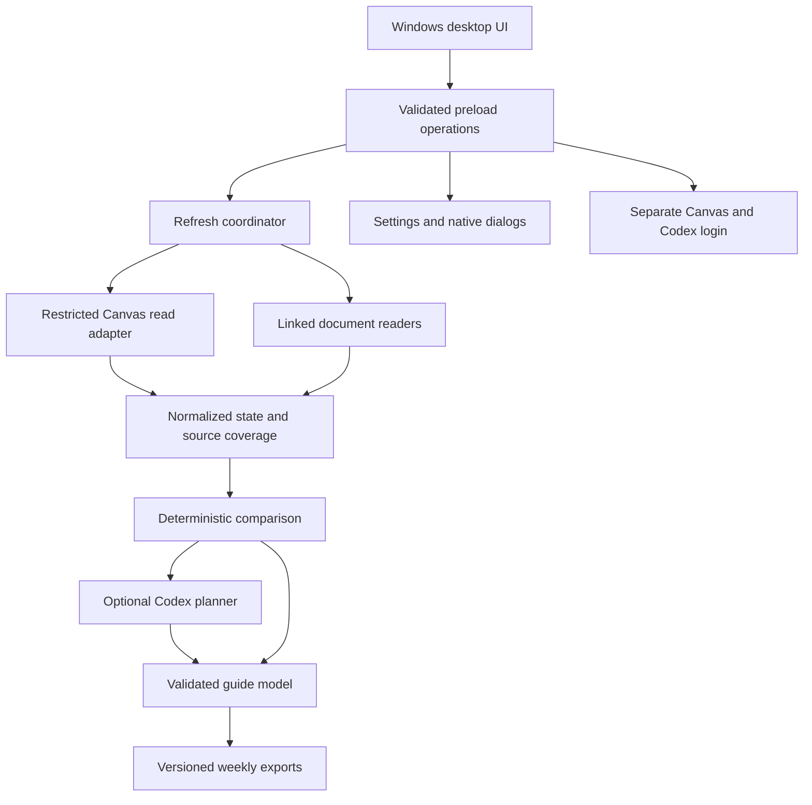

Application architecture
========================

Status: implementation target with delivered components tracked in implementation-plan.md.
The admitted Canvas path is the fixed metadata collector described in
[its admission decision](canvas-metadata-admission.md), followed by the stored
[syllabus field](canvas-syllabus-review.md) and two
[course-message queries](canvas-message-review.md). These sources share the same
account binding, request gate and budgets. Optional syllabus/message
failures become coverage gaps; connection, cancellation and audit failures stop
export. Legacy REST body collection
remains disabled; no general GraphQL or browser-action bridge is exposed.

Decisions
---------

Use Electron with JavaScript modules, a local HTML/CSS renderer, and Node's test
runner. A small application does not need a UI framework or bundler initially.
Electron provides Windows known folders, native dialogs, OS appearance detection,
and a consistent runtime. Retain the native title bar for ordinary Windows window
management. Package with a reproducible npm lockfile and a Windows packaging tool.

The renderer is sandboxed with context isolation and no Node integration. The
preload bridge exposes named operations only, never generic IPC, shell, fetch, or
filesystem access. Validate sender and input on every privileged IPC boundary.
Serve packaged local UI only with a restrictive Content Security Policy; deny
renderer navigation and unexpected windows. Main process owns connections/storage.

Components
----------

The legacy CanvasClient.collect refuses all scans. Its remaining operation table
supports only separately reviewed connection/name reads, never arbitrary AI URLs.
Assignments, pages, modules and conversation REST bodies are excluded. Setting
auto_mark_as_read=false alone was insufficient because conversation attachment
serialization could invoke lock/progression checks. Do not access quiz questions,
answers, attempt routes or external tool launches. GET alone does not prove safety.

Manual guide refresh instead calls CanvasConnection.collectMetadata, currently
enabled for the fixed reviewed metadata, syllabus and message operations. Both
the main IPC handler and connection method retain a collectionIssue guard so a
future hold fails before requests or storage changes. Connection checks, source
coverage and retained last-known content remain visible to the student.
Assignments, quizzes and pages are removed from the REST operation table; the
network gate therefore rejects their formerly accepted URLs. Downstream rendering,
reconciliation and export remain independently testable with supplied records.
See canvas-read-boundary.md for the transitive permission/serialization audit and
requirements to restore the full collector. This hold is not the final architecture.

The replacement bridge creates one CanvasMetadataTransport per selected course,
using the captured local/global identity and connection lifetime. Account and
enrollment preflights precede the fixed metadata queries. The session's existing
request listener delegates to the active transport's exact pending-request
check; it is not a persistent GraphQL permission or a second competing listener.
The transport is removed on success, failure or cancellation. Concurrent runs
are rejected. The bridge watches session cookies itself, checks its binding at
asynchronous boundaries, and discards results after account or course changes.
The refresh coordinator retains its independent checks before guide persistence.
The generic GraphQL surface remains denied; only pending exact requests are admitted.

Module/module-item listing is disabled after the safety audit: Canvas can create
and evaluate student progression on these reads. Preserve previous module evidence
as stale and report missing coverage. See safety-audit.md for the evidence and
remaining live authentication checks; no live-account invariance claim is supported.

Standard Canvas file views/downloads are also excluded because they can update
module progress. The retained file-name operation requires only[]=names and is
not called by the metadata scan. Saved file references remain available. The login
guard and separate website adapter reject Canvas file routes even on other hosts. Alternative direct storage access needs separate
authorization and destination review; see canvas-file-access.md.

Browser authentication is a human-operated phase in an isolated profile with no
app preload or Node integration. Close the login surface before collection and
use reviewed structured reads through its session if institution-permitted. If
session reads are unavailable, expose supported API token connection or an honest
coverage gap. No autonomous unrestricted navigation. UI login can generate normal
access logs; do not claim zero server-side effects.

CanvasConnection owns an abortable connection lifetime. Starting a new login or
token connection, disconnecting, changing course selection, or verifying a
different account invalidates the old lifetime. Clients capture their origin,
credential and signal instead of borrowing changing connection state. Verification
results and errors from invalidated lifetimes cannot overwrite the current account;
an old promise's cleanup cannot clear a newer verification. Local credential writes
and removals are serialized so a delayed token save cannot undo Disconnect.
Session verification waits for pending cookie cleanup before issuing a read.

A guide run captures a fixed origin, user ID and immutable course-ID list, checks
that binding after asynchronous collection stages, and combines its signal with
user cancellation through external collection, AI planning and export. Course-list
loading similarly validates the captured identity before publishing loaded data.
The local capture object alone does not prove enrollment roles or detect remote
cookie changes. The metadata path adds session-cookie watchers, identity checks,
account/enrollment preflights and standard-student-role restrictions described in
canvas-metadata-admission.md. These source-reviewed checks are implemented and
tested locally; institution deployment compatibility still requires live evidence.

Browser-session verification fails closed with a credential-free CW_SESSION_ code:
MISSING, AMBIGUOUS, SCOPE, FLAGS, VALUE, EXPIRY, LOOKUP, TIMEOUT or CONFIGURATION.
The UI reports which precondition failed without disclosing cookie values, domain
details or storage exceptions. These diagnostics do not relax cookie validation
or admit additional requests. Connected indicates successful profile verification;
it does not establish that the stricter refresh session checks have passed. A
failed refresh preserves the previous guide. Institutional compatibility must be
investigated from the specific failure before changing the guard.

The isolated Electron connection fixture exercises eight lifecycle scenarios.
The desktop refresh fixture also deliberately returns data after invalidating the
connection and verifies that no guide format is overwritten. Neither fixture
contacts a real Canvas account.

The session network gate registers each exact collector URL only for the duration
of its pending GET/manual-redirect fetch. Revalidate its origin, operation and
fixed parameters at this boundary. Reject browser-originated requests even when
their URL matches a pending collector read. With no login window, all other
session traffic is denied. During human login, permit Canvas login routes and
known static-asset paths, but reject dashboard API calls and non-login writes.
External HTTPS identity-provider traffic must belong to that login webContents;
institution-specific SSO origin configuration remains a future hardening step.

Linked sources are discovered as references with provenance. Fetch only relevant
HTTPS documents with a size limit and timeouts; reject private network targets,
assessment launches, credential-bearing URLs and unsafe redirects. Never attach
Canvas authorization to external requests. Initially unsupported documents are
listed as gaps, then add typed parsers and bounded extraction.

CourseWebsites stores per-account course/site associations and encrypted Basic
credentials. Its public list omits credentials; narrow IPC supports add, check,
login and remove. SiteReader traverses only the configured HTTPS origin and path,
without a browser, scripts, cookies or forms. DNS is checked and pinned for each
request, Basic credentials require a matching challenge, and redirects never
inherit authorization. Durable request intent/outcome logging precedes/follows
transport calls. See external-course-sources.md for limits and unsupported cases.
Reconciliation adds website evidence to the same course while leaving Canvas
assessment dates and submission status unchanged.

Persistence and export
----------------------

Use a versioned JSON state envelope and atomic single-file replacement initially;
one desktop instance and a refresh mutex serialize writes. A transactional SQLite
migration can be introduced when partial indexing needs justify it. Keep settings,
collection snapshots and notes separated logically; never store credentials in
the course state or exports. Encrypt optional API credentials with Electron
safeStorage on Windows and reject persistent credential storage if unavailable.

Development app data belongs under ignored .local/ in the repository. Packaged
app data belongs in Windows user application storage. Default exports resolve
Electron app.getPath('desktop') plus Canvas Weekly. Folder overrides affect new
exports, not the history database or previous folders. Do not move old output.

Each run stores a source coverage ledger (ok/error/unsupported/locked), observed
records and timestamps. An incomplete collection preserves last known records
with stale markers. Disappearance alone is not cancellation. Keep stable Canvas
IDs and linked quiz/assignment IDs for deduplication. Source claims include URL,
retrieval time and original content; suggestions are separate from course facts.

Canvas collector requests also append a credential-free local JSONL audit record
before transmission and after response headers or network failure. Flush intent
to disk before fetching; refuse the source when logging fails. Do not log query
strings (pagination cursors may be sensitive), credentials, bodies or exception
text. These logs cover collector requests, not authentication-window traffic, and
cannot prove the absence of server-side side effects. Unpaired intent is uncertain.

Week identity is Monday's YYYY-MM-DD in the configured academic IANA timezone.
Preserve exact UTC deadlines plus display timezone. Week rollover, DST boundaries,
due overrides, null deadlines, overdue work and optional retries require tests.

Render Markdown, standalone HTML and Word documents from the same plan.
Parse generated Markdown with markdown-it,
with source HTML disabled, HTTPS-only source links, no images and no scripts.
The HTML includes a CSP permitting only its hashed inline stylesheet. All fonts
are local system fonts. Light/dark and print styles require no network access.

Word export uses the pinned docx runtime library in the app, without Python or
Office on the student's computer. The compact reference preset sets Letter paper,
one-inch margins, Calibri 11-point body text and explicit heading/list spacing.
Native lists, headings, hyperlinks and page-number furniture replace HTML markup;
remote resources, macros and course-supplied field instructions are never embedded.
Content/structure tests pass. An optional Microsoft Word 16.0 check rendered a
six-page synthetic guide; every page was inspected. This does not establish
layout for arbitrary course content or other Office versions. See word-layout-check.md.

Revision changed Markdown/HTML/Word files with a shared revision ID. An ownership
marker stores separate content hashes; existing unowned or manually edited files
block replacement. Old Markdown-only or Markdown/HTML folders acquire missing
formats on their next local export. Word's input hash includes a renderer version;
unchanged input reuses verified existing bytes despite variable ZIP metadata.
Stage changed documents, recheck existing byte contents, then replace individual
files atomically and publish marker/state. Roll back replacements on ordinary
errors; a process crash can still interrupt the multi-file update, in which case
hash mismatches prevent silent replacement on the next attempt. Never overwrite
Student Notes. Unchanged documents do not create revisions. No sample data is
exported as live.

Codex connection
----------------

Use the official local Codex app-server JSON-RPC protocol over stdio. On Windows,
resolve the pinned @openai/codex runtime dependency first; an explicit executable
selection overrides it. Package native runtime files outside app.asar. Launch
without shell interpolation or a visible console; use a separate application
Codex home so app credentials and configuration do not overwrite the user's setup.

Initialize once, handle request IDs, timeouts, process exit, streamed events and
login completion. ChatGPT sign-in uses account/login/start and the returned
official auth URL, opened by the main process after validation. Never scrape the
ChatGPT web UI or extract tokens from another app. Display account connection and
usage errors honestly; no automatic paid fallback.

Planner receives bounded course evidence, not Canvas secrets. Use a read-only
agent environment, prohibit tool-based Canvas access and validate structured
output against the allowed source IDs, bounded preparation steps, suggested dates
and source quotes for required/optional claims. Quotes support review but cannot
prove semantic correctness. AI interpretation is optional: fall back
to a clearly labeled factual guide on connection, quota, or parsing failure.

Claude/Gemini are later adapters with provider-specific supported authentication.
Do not equate ordinary chat subscription sign-in with general API permission.

Quality and delivery
--------------------

Use node --test for dates, read allowlists, pagination, failure preservation,
normalization and revision safety. Use Electron automation for native bridge,
theme and onboarding tests without personal credentials. Use synthetic fixtures.
Keep network and subprocess adapters injectable to test unexpected failures.

Installer builds must include only app code/runtime, never .local/, auth data,
exports or diagnostics. Signing and auto-update publication remain release tasks
requiring an actual signing identity and release destination. Produce an unsigned
local build for review first. Do not silently install startup tasks or schedule.

The local x64 NSIS package is now implemented with an explicit source allowlist,
production dependency collection and unpacked Codex platform binaries. Packaged
tests require an explicit isolated profile and check installer payload identity,
fresh state, bundled runtime execution and persisted appearance. Signing, actual
installation/uninstallation and clean-machine verification remain incomplete;
see [Windows packaging](windows-package.md).

References
----------

- [Electron dark mode](https://www.electronjs.org/docs/latest/tutorial/dark-mode)
- [Electron security](https://www.electronjs.org/docs/latest/tutorial/security)
- [Codex app server](https://learn.chatgpt.com/docs/app-server)
- [Official Codex CLI](https://learn.chatgpt.com/docs/codex/cli)
- [Markdown-it parser](https://github.com/markdown-it/markdown-it)
- [Canvas conversations](https://developerdocs.instructure.com/services/canvas/resources/conversations)
- [Canvas page listing and body inclusion](https://github.com/instructure/canvas-lms/blob/master/app/controllers/wiki_pages_api_controller.rb)
- [Canvas module items](https://developerdocs.instructure.com/services/canvas/resources/modules)
- [External course site adapter design](external-course-sources.md)
