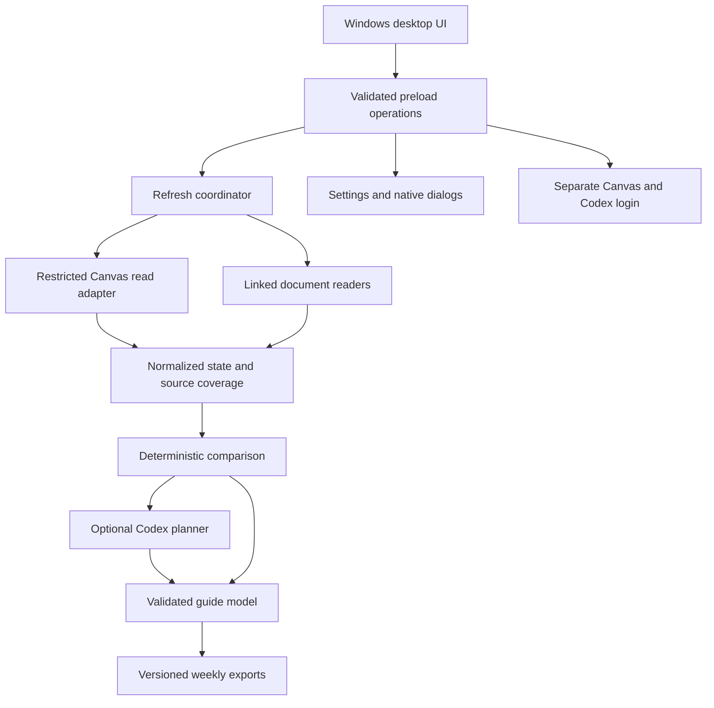

Application architecture
========================

Status: implementation target. See implementation-plan.md for delivered scope.

Decisions
---------

Use Electron with JavaScript modules, a local HTML/CSS renderer, and Node's test
runner. A small application does not need a UI framework or bundler initially.
Electron provides Windows known folders, native dialogs, OS appearance detection,
and a consistent runtime. Retain the native title bar for ordinary Windows window
management. Package with a reproducible npm lockfile and a Windows packaging tool.

The renderer is sandboxed with context isolation and no Node integration. The
preload bridge exposes named operations only, never generic IPC, shell, fetch, or
filesystem access. Validate sender and input on every privileged IPC boundary.
Serve packaged local UI only with a restrictive Content Security Policy; deny
renderer navigation and unexpected windows. Main process owns connections/storage.

Components
----------

The Canvas adapter permits only a finite set of GET endpoints and validated
parameters. It does not accept arbitrary URLs from the AI. Resolve pagination only
inside the same Canvas origin and endpoint. Disable automatic redirects and
validate any explicitly followed redirect. Set auto_mark_as_read=false for Inbox
details. Do not access quiz questions, answers, attempt routes, or external tool
launch endpoints. Enforce student self-submission scope. Allowing GET alone is
insufficient: some reads mutate state.

Module/module-item listing is disabled after the safety audit: Canvas can create
and evaluate student progression on these reads. Preserve previous module evidence
as stale and report missing coverage. See safety-audit.md for the evidence and
outstanding network/logging work; no live-account invariance claim is supported.

Browser authentication is a human-operated phase in an isolated profile with no
app preload or Node integration. Close the login surface before collection and
use reviewed structured reads through its session if institution-permitted. If
session reads are unavailable, expose supported API token connection or an honest
coverage gap. No autonomous unrestricted navigation. UI login can generate normal
access logs; do not claim zero server-side effects.

Linked sources are discovered as references with provenance. Fetch only relevant
HTTP(S) documents with a size limit and timeouts; reject private network targets,
assessment launches, credential-bearing URLs and unsafe redirects. Never attach
Canvas authorization to external requests. Initially unsupported documents are
listed as gaps, then add typed parsers and bounded extraction.

Persistence and export
----------------------

Use a versioned JSON state envelope and atomic single-file replacement initially;
one desktop instance and a refresh mutex serialize writes. A transactional SQLite
migration can be introduced when partial indexing needs justify it. Keep settings,
collection snapshots and notes separated logically; never store credentials in
the course state or exports. Encrypt optional API credentials with Electron
safeStorage on Windows and reject persistent credential storage if unavailable.

Development app data belongs under ignored .local/ in the repository. Packaged
app data belongs in Windows user application storage. Default exports resolve
Electron app.getPath('desktop') plus Canvas Weekly. Folder overrides affect new
exports, not the history database or previous folders. Do not move old output.

Each run stores a source coverage ledger (ok/error/unsupported/locked), observed
records and timestamps. An incomplete collection preserves last known records
with stale markers. Disappearance alone is not cancellation. Keep stable Canvas
IDs and linked quiz/assignment IDs for deduplication. Source claims include URL,
retrieval time and original content; suggestions are separate from course facts.

Week identity is Monday's YYYY-MM-DD in the configured academic IANA timezone.
Preserve exact UTC deadlines plus display timezone. Week rollover, DST boundaries,
due overrides, null deadlines, overdue work and optional retries require tests.

Render deterministic Markdown first and verified Word next. Revision existing
generated files, detect unexpected manual changes, stage new output and replace
atomically. Never overwrite Student Notes. Publish state after successful export;
retain prior state on failed/cancelled runs. No sample data is exported as live.

Codex connection
----------------

Use the official local Codex app-server JSON-RPC protocol over stdio. Discover an
installed executable and allow explicit executable selection if absent. Launch
without shell interpolation or a visible console; use a separate application
Codex home so app credentials and configuration do not overwrite the user's setup.

Initialize once, handle request IDs, timeouts, process exit, streamed events and
login completion. ChatGPT sign-in uses account/login/start and the returned
official auth URL, opened by the main process after validation. Never scrape the
ChatGPT web UI or extract tokens from another app. Display account connection and
usage errors honestly; no automatic paid fallback.

Planner receives bounded course evidence, not Canvas secrets. Use a read-only
agent environment, prohibit tool-based Canvas access and validate structured
output against the allowed source IDs. AI interpretation is optional: fall back
to a clearly labeled factual guide on connection, quota, or parsing failure.

Claude/Gemini are later adapters with provider-specific supported authentication.
Do not equate ordinary chat subscription sign-in with general API permission.

Quality and delivery
--------------------

Use node --test for dates, read allowlists, pagination, failure preservation,
normalization and revision safety. Use Electron automation for native bridge,
theme and onboarding tests without personal credentials. Use synthetic fixtures.
Keep network and subprocess adapters injectable to test unexpected failures.

Installer builds must include only app code/runtime, never .local/, auth data,
exports or diagnostics. Signing and auto-update publication remain release tasks
requiring an actual signing identity and release destination. Produce an unsigned
local build for review first. Do not silently install startup tasks or schedule.

References
----------

- [Electron dark mode](https://www.electronjs.org/docs/latest/tutorial/dark-mode)
- [Electron security](https://www.electronjs.org/docs/latest/tutorial/security)
- [Codex app server](https://learn.chatgpt.com/docs/app-server)
- [Canvas conversations](https://developerdocs.instructure.com/services/canvas/resources/conversations)
- [Canvas page listing and body inclusion](https://github.com/instructure/canvas-lms/blob/master/app/controllers/wiki_pages_api_controller.rb)
- [Canvas module items](https://developerdocs.instructure.com/services/canvas/resources/modules)
- [External course site adapter design](external-course-sources.md)
